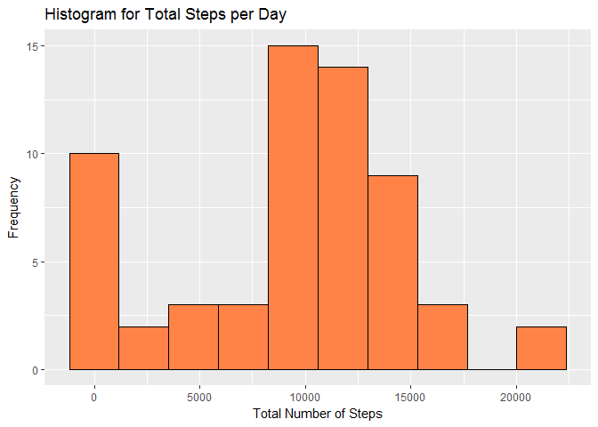
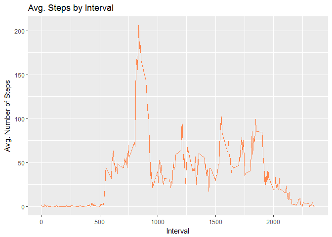
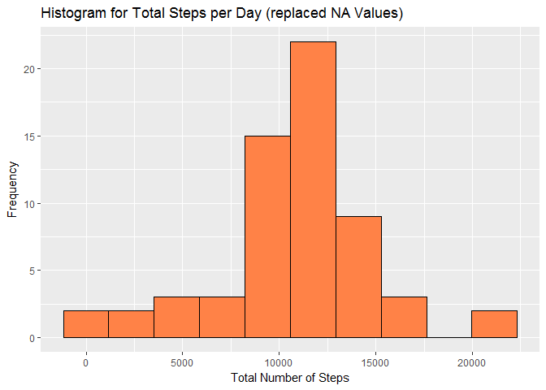
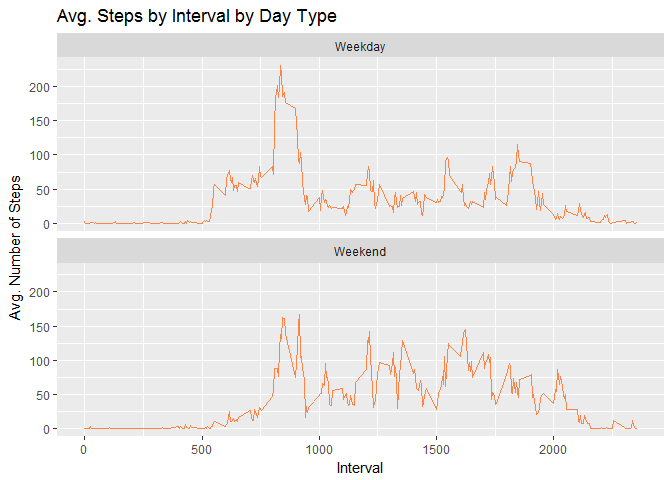

# Quantified Self Analysis
Alejandro Montoya  

##Introduction

It is now possible to collect a large amount of data about personal movement using activity monitoring devices such as [Fitbit](http://www.fitbit.com/), [Nike Fuelband](http://www.nike.com/us/en_us/c/nikeplus-fuelband), or [Jawbone Up](https://jawbone.com/up). These type of devices are part of the "quantified self" movement - a group of enthusiasts who take measurements about themselves regularly to improve their health, to find patterns in their behavior, or because they are tech geeks. But these data remain under-utilized both because the raw data are hard to obtain and there is a lack of statistical methods and software for processing and interpreting the data.

This assignment makes use of data from a personal activity monitoring device. This device collects data at 5 minute intervals through out the day. The data consists of two months of data from an anonymous individual collected during the months of October and November, 2012 and include the number of steps taken in 5 minute intervals each day.

The variables included in this dataset are:

* steps: Number of steps taking in a 5-minute interval (missing values are coded as NA)
* date: The date on which the measurement was taken in YYYY-MM-DD format
* interval: Identifier for the 5-minute interval in which measurement was taken

The dataset is stored in a comma-separated-value (CSV) file and there are a total of 17,568 observations in this dataset.

##Preparation

We'll load some libraries (like dplyr or ggplot2) that will be useful with the analysis of the data


```r
#Adds some needed libraries
library(dplyr)
library(ggplot2)
```

## Loading and Processing the data

The first thing to do is to load the activity data from the CSV file provided into a data frame. We'll simply do this by invoking the **read.csv()** function with the stringsAsFactor parameter set to FALSE


```r
#Loads the data into a data fram
activityDF <- read.csv("activity.csv", stringsAsFactors = FALSE)
```

##What is mean total number of steps taken per day?

In order to answer this question, we'll first create a new data frame that stores the number of steps taken by the person on a per day basis.


```r
#Creates a new data frame that has the calculation of the Total Steps per day
stepsByDay <- summarise(group_by(activityDF, date), Total.Steps = sum(steps, na.rm = TRUE))
head(stepsByDay)
```

```
## # A tibble: 6 × 2
##         date Total.Steps
##        <chr>       <int>
## 1 2012-10-01           0
## 2 2012-10-02         126
## 3 2012-10-03       11352
## 4 2012-10-04       12116
## 5 2012-10-05       13294
## 6 2012-10-06       15420
```

Then, we create a histogram using the newly created dataframe


```r
#Creates an histogram for the Total Steps per day
qplot(stepsByDay$Total.Steps, 
      geom = "histogram", 
      fill = I("sienna1"), 
      col = I("black"), 
      bins = 10, 
      main = "Histogram for Total Steps per Day",
      xlab = "Total Number of Steps", 
      ylab = "Frequency")
```

<!-- -->

Finally, we calculate the mean and the median of the Total Steps per day for all the reported days


```r
#Calculates the mean and median of the Total Steps per day
summary(stepsByDay$Total.Steps)
```

```
##    Min. 1st Qu.  Median    Mean 3rd Qu.    Max. 
##       0    6778   10400    9354   12810   21190
```

##What is the average daily activity pattern?

First, let's calculate the average number of steps by interval for all days in the study

```r
#Creates a new data frame that has the calculation of the Average Steps per Interval
stepsByInterval <- summarise(group_by(activityDF, interval), Mean.Steps = mean(steps, na.rm = TRUE))
head(stepsByInterval)
```

```
## # A tibble: 6 × 2
##   interval Mean.Steps
##      <int>      <dbl>
## 1        0  1.7169811
## 2        5  0.3396226
## 3       10  0.1320755
## 4       15  0.1509434
## 5       20  0.0754717
## 6       25  2.0943396
```

Now, let's plot this data

```r
#Creates a plot with the data of Avg Steps by Interval
ggplot(stepsByInterval, aes(interval, Mean.Steps, col = I("sienna1"))) + 
  ggtitle("Avg. Steps by Interval") + 
  xlab ("Interval") + 
  ylab("Avg. Number of Steps") + 
  geom_line()
```

<!-- -->

Finally, let's check which interval has the biggest Avg. of steps for all days

```r
#Gets the interval with the biggest Avg
stepsByInterval[which.max(stepsByInterval$Mean.Steps),]
```

```
## # A tibble: 1 × 2
##   interval Mean.Steps
##      <int>      <dbl>
## 1      835   206.1698
```

##Imputing missing values

Let's find out how many records we have with missing values in the "steps" column


```r
sum(is.na(activityDF$steps))
```

```
## [1] 2304
```

We are going to imput missing values to try to identify if the presence of them affects the results that we have obtained. We are going to replace the missing values for the average of steps in the same interval for all days and store it in a new dataframe


```r
#Creates a new dataframe as a copy of the original dataframe
noNAActivityDF <- activityDF

#Replaces the NA values in the step column for the average steps value for the same interval
noNAActivityDF$steps <- ifelse(is.na(noNAActivityDF$steps) == TRUE, stepsByInterval$Mean.Steps[stepsByInterval$interval %in% noNAActivityDF$interval], noNAActivityDF$steps)

#Confirms that there are no more NA values
sum(is.na(noNAActivityDF$steps))
```

```
## [1] 0
```

Finally, let's see if there's a difference in the histogram and the mean and median values when compared against the original dataframe (i.e. the one with the NA values)


```r
#Creates a new dataframe with the new values of Total Steps per Day
noNAstepsByDay <- summarise(group_by(noNAActivityDF, date), Total.Steps = sum(steps, na.rm = TRUE))

#Creates an histogram for the Total Steps per day
qplot(noNAstepsByDay$Total.Steps, 
      geom = "histogram", 
      fill = I("sienna1"), 
      col = I("black"), 
      bins = 10, 
      main = "Histogram for Total Steps per Day (replaced NA Values)",
      xlab = "Total Number of Steps", 
      ylab = "Frequency")
```

<!-- -->

```r
#Calculates the mean and median of the Total Steps per day
summary(noNAstepsByDay$Total.Steps)
```

```
##    Min. 1st Qu.  Median    Mean 3rd Qu.    Max. 
##      41    9819   10770   10770   12810   21190
```

As we can see, there's a difference between the mean and median of both data sets.

##Are there differences in activity patterns between weekdays and weekends?

First, let's create a new factor column to the dataframe without the NA values that's going to indicate if the date is a Weekday or a Weekend


```r
#Adds a new column to indicate if the date is weekday or weekend
noNAActivityDF$Day.Type <- ifelse(weekdays(as.Date(noNAActivityDF$date)) == 'Saturday' | weekdays(as.Date(noNAActivityDF$date)) == 'Sunday', "Weekend", "Weekday")
head(noNAActivityDF)
```

```
##       steps       date interval Day.Type
## 1 1.7169811 2012-10-01        0  Weekday
## 2 0.3396226 2012-10-01        5  Weekday
## 3 0.1320755 2012-10-01       10  Weekday
## 4 0.1509434 2012-10-01       15  Weekday
## 5 0.0754717 2012-10-01       20  Weekday
## 6 2.0943396 2012-10-01       25  Weekday
```

Now, let's create a new dataframe with the avg steps by interval and day type (i.e. weekday / weekend)


```r
#Creates a new dataframe with the avg steps by interval and day type
noNAStepsByInterval <- summarise(group_by(noNAActivityDF, interval, Day.Type), Mean.Steps = mean(steps))
head(noNAStepsByInterval)
```

```
## Source: local data frame [6 x 3]
## Groups: interval [3]
## 
##   interval Day.Type Mean.Steps
##      <int>    <chr>      <dbl>
## 1        0  Weekday 2.25115304
## 2        0  Weekend 0.21462264
## 3        5  Weekday 0.44528302
## 4        5  Weekend 0.04245283
## 5       10  Weekday 0.17316562
## 6       10  Weekend 0.01650943
```

Finally, let's plot these averages comparing them between day types


```r
#Creates a plot with 2 panels to compare the avg steps by interval by day type
ggplot(noNAStepsByInterval, aes(interval, Mean.Steps, col = I("sienna1"))) + 
  ggtitle("Avg. Steps by Interval by Day Type") + 
  xlab ("Interval") + 
  ylab("Avg. Number of Steps") + 
  geom_line() + 
  facet_wrap(~ Day.Type, nrow = 2)
```

<!-- -->
